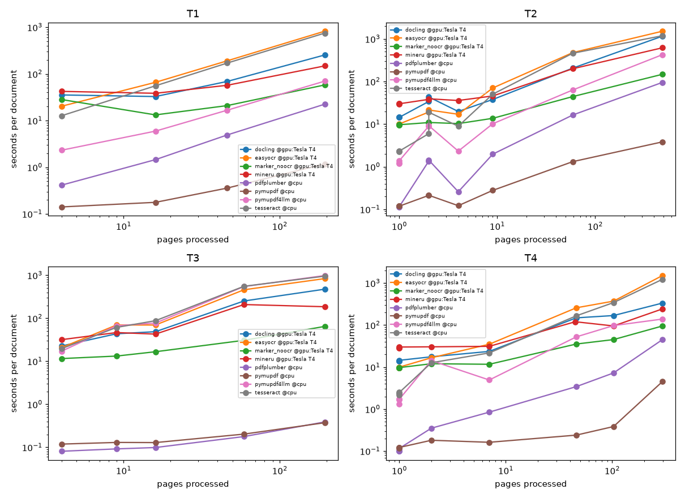
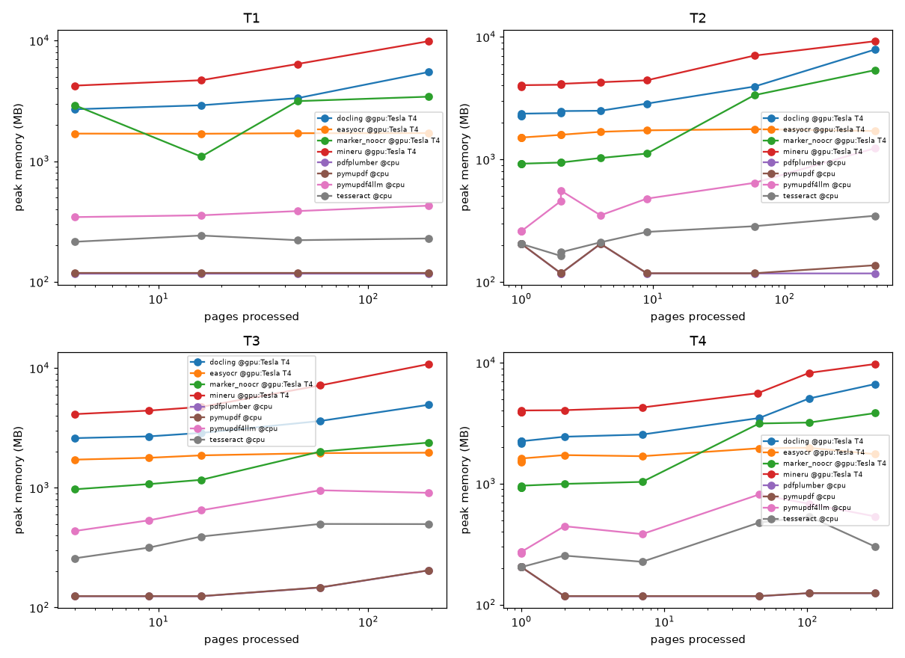

# PDF extraction benchmark report
Runs come from 2 machines: gpu:Tesla T4 (4 CPUs, 31.3 GB RAM, GPU Tesla T4, 15360 MiB); cpu (4 CPUs, 31.3 GB RAM). Speed, memory and failure rows are labelled `extractor @machine`; quality rows are not machine-specific.
Sampled runs (first pages only, not comparable to full runs): none.

## Capability matrix
| extractor | page_numbers | bboxes | tables | figures | ocr |
|---|---|---|---|---|---|
| pymupdf | yes | yes | no | no | no |
| pymupdf4llm | yes | yes | yes | yes | yes |
| pdfplumber | yes | yes | yes | no | no |
| docling | yes | yes | yes | yes | yes |
| marker (disabled) | yes | no | yes | no | yes |
| marker_noocr (marker variant) | yes | no | yes | no | no |
| mineru | yes | yes | yes | no | yes |
| tesseract | yes | yes | no | no | yes |
| easyocr | yes | yes | no | no | yes |
| paddleocr_vl (disabled) | yes | no | yes | no | yes |

## Extraction quality by tier
### T1: agreement with PyMuPDF's text layer (reference, not truth — pymupdf is the reference itself)
text_similarity by page-count bucket (higher is closer to PyMuPDF). Retrieval hit@5 below is the T1 headline.
| extractor | S | M | L | XL |
|---|---|---|---|---|
| docling | 0.73 | 0.70 | 0.84 | 0.84 |
| easyocr | 0.67 | 0.68 | 0.81 | 0.82 |
| marker_noocr | 0.79 | 0.82 | 0.87 | 0.92 |
| mineru | 0.63 | 0.73 | 0.80 | 0.78 |
| pdfplumber | 0.70 | 0.70 | 0.82 | 0.83 |
| pymupdf | 1.00 | 1.00 | 1.00 | 1.00 |
| pymupdf4llm | 0.69 | 0.69 | 0.83 | 0.84 |
| tesseract | 0.69 | 0.70 | 0.83 | 0.83 |

### T2: teds (higher is better), by page-count bucket
| extractor | S | M | L | XL |
|---|---|---|---|---|
| docling | 0.56 | 0.72 | 0.76 | 1.00 |
| easyocr | 0.00 | 0.00 | 0.00 | 0.00 |
| marker_noocr | 0.54 | 0.84 | 0.80 | 0.58 |
| mineru | 1.00 | 0.77 | 0.69 | 0.94 |
| pdfplumber | 0.57 | 0.09 | 0.03 | 0.20 |
| pymupdf | 0.00 | 0.00 | 0.00 | 0.00 |
| pymupdf4llm | 0.57 | 0.66 | 0.71 | 0.91 |
| tesseract | 0.00 | 0.00 | 0.00 | 0.00 |

### T3: cer (lower is better), by page-count bucket
| extractor | S | M | L | XL |
|---|---|---|---|---|
| docling | 0.42 | 0.43 | 0.48 | 0.21 |
| easyocr | 0.34 | 0.48 | 0.62 | 0.18 |
| marker_noocr | 1.00 | 1.00 | 1.00 | 1.00 |
| mineru | 0.37 | 0.39 | 0.40 | 0.25 |
| pdfplumber | 1.00 | 1.00 | 1.00 | 1.00 |
| pymupdf | 1.00 | 1.00 | 1.00 | 1.00 |
| pymupdf4llm | 0.31 | 0.41 | 0.57 | 0.17 |
| tesseract | 0.29 | 0.36 | 0.44 | 0.17 |

### T4: figure_fact_recall (higher is better), by page-count bucket
| extractor | S | M | L | XL |
|---|---|---|---|---|
| docling | 0.03 | — | — | — |
| easyocr | 0.84 | — | — | — |
| marker_noocr | 0.00 | — | — | — |
| mineru | 0.07 | — | — | — |
| pdfplumber | 0.00 | — | — | — |
| pymupdf | 0.00 | — | — | — |
| pymupdf4llm | 0.55 | — | — | — |
| tesseract | 0.65 | — | — | — |

### Table detection recall by tier
| extractor | T1 | T2 | T3 | T4 |
|---|---|---|---|---|
| docling | 1.00 | 0.86 | 1.00 | 1.00 |
| easyocr | 0.00 | 0.00 | 0.00 | 0.00 |
| marker_noocr | 1.00 | 0.86 | 0.00 | 1.00 |
| mineru | 1.00 | 1.00 | 1.00 | 1.00 |
| pdfplumber | 1.00 | 0.48 | 0.00 | 1.00 |
| pymupdf | 0.00 | 0.00 | 0.00 | 0.00 |
| pymupdf4llm | 1.00 | 0.86 | 1.00 | 1.00 |
| tesseract | 0.00 | 0.00 | 0.00 | 0.00 |

## Retrieval hit@5 — chunking: baseline
### By tier
| extractor | T1 | T2 | T3 | T4 |
|---|---|---|---|---|
| docling | 0.88 | 0.77 | 0.84 | 0.75 |
| easyocr | 0.92 | 0.62 | 0.84 | 0.92 |
| marker_noocr | 0.83 | 0.55 | 0.00 | 0.63 |
| mineru | 0.94 | 0.65 | 0.84 | 0.84 |
| pdfplumber | 0.94 | 0.65 | 0.00 | 0.81 |
| pymupdf | 0.96 | 0.82 | 0.00 | 0.83 |
| pymupdf4llm | 0.94 | 0.69 | 0.86 | 0.73 |
| tesseract | 0.98 | 0.65 | 0.84 | 0.87 |
### By page-count bucket
| extractor | S | M | L | XL |
|---|---|---|---|---|
| docling | 0.73 | 0.81 | 0.83 | 0.84 |
| easyocr | 0.73 | 0.83 | 0.83 | 0.88 |
| marker_noocr | 0.38 | 0.52 | 0.65 | 0.47 |
| mineru | 0.68 | 0.84 | 0.83 | 0.88 |
| pdfplumber | 0.51 | 0.48 | 0.65 | 0.74 |
| pymupdf | 0.65 | 0.48 | 0.70 | 0.76 |
| pymupdf4llm | 0.63 | 0.93 | 0.85 | 0.78 |
| tesseract | 0.70 | 0.78 | 0.93 | 0.91 |

## Retrieval hit@5 — chunking: structure_preserving
### By tier
| extractor | T1 | T2 | T3 | T4 |
|---|---|---|---|---|
| docling | 0.94 | 0.66 | 0.84 | 0.78 |
| easyocr | 0.92 | 0.55 | 0.72 | 0.90 |
| marker_noocr | 0.83 | 0.60 | 0.00 | 0.67 |
| mineru | 0.96 | 0.60 | 0.86 | 0.83 |
| pdfplumber | 0.94 | 0.62 | 0.00 | 0.81 |
| pymupdf | 0.90 | 0.82 | 0.00 | 0.83 |
| pymupdf4llm | 0.94 | 0.66 | 0.84 | 0.71 |
| tesseract | 0.92 | 0.65 | 0.81 | 0.87 |
### By page-count bucket
| extractor | S | M | L | XL |
|---|---|---|---|---|
| docling | 0.60 | 0.91 | 0.78 | 0.90 |
| easyocr | 0.73 | 0.76 | 0.72 | 0.84 |
| marker_noocr | 0.38 | 0.53 | 0.65 | 0.53 |
| mineru | 0.68 | 0.88 | 0.78 | 0.86 |
| pdfplumber | 0.51 | 0.48 | 0.61 | 0.74 |
| pymupdf | 0.65 | 0.48 | 0.65 | 0.76 |
| pymupdf4llm | 0.63 | 0.83 | 0.89 | 0.78 |
| tesseract | 0.68 | 0.74 | 0.91 | 0.90 |

## Speed
Per-document seconds include interpreter start and model loading; the fit separates that fixed cost. The fit is least squares of seconds on pages over full (not sampled) successful runs; with fewer than 3 documents it falls back to mean seconds per page and no fixed cost.
| extractor | fixed s | s/page | docs |
|---|---|---|---|
| docling @gpu:Tesla T4 | 15.7 | 1.981 | 27 |
| easyocr @gpu:Tesla T4 | 43.0 | 3.686 | 27 |
| marker_noocr @gpu:Tesla T4 | 12.0 | 0.279 | 27 |
| mineru @gpu:Tesla T4 | 33.7 | 1.018 | 27 |
| pdfplumber @cpu | 0.0 | 0.164 | 27 |
| pymupdf @cpu | 0.1 | 0.008 | 27 |
| pymupdf4llm @cpu | 35.6 | 1.062 | 27 |
| tesseract @cpu | 49.3 | 3.097 | 27 |

### Seconds per page by page-count bucket (raw, includes fixed cost)
| extractor | S | M | L | XL |
|---|---|---|---|---|
| docling @gpu:Tesla T4 | 12.808 | 3.504 | 3.124 | 1.780 |
| easyocr @gpu:Tesla T4 | 8.592 | 5.812 | 6.402 | 4.073 |
| marker_noocr @gpu:Tesla T4 | 7.447 | 1.305 | 0.624 | 0.339 |
| mineru @gpu:Tesla T4 | 22.140 | 3.960 | 2.705 | 0.947 |
| pdfplumber @cpu | 0.194 | 0.089 | 0.115 | 0.107 |
| pymupdf @cpu | 0.095 | 0.017 | 0.009 | 0.007 |
| pymupdf4llm @cpu | 2.453 | 2.898 | 2.955 | 1.546 |
| tesseract @cpu | 3.496 | 4.898 | 6.127 | 3.736 |

## Speed by kind of PDF
Fitted seconds per page (fixed cost removed where at least 3 documents allow a fit).
### Seconds per page by tier
| extractor | T1 | T2 | T3 | T4 |
|---|---|---|---|---|
| docling @gpu:Tesla T4 | 1.199 | 2.343 | 2.373 | 1.104 |
| easyocr @gpu:Tesla T4 | 4.239 | 3.080 | 4.261 | 4.975 |
| marker_noocr @gpu:Tesla T4 | 0.204 | 0.283 | 0.276 | 0.291 |
| mineru @gpu:Tesla T4 | 0.587 | 1.204 | 0.800 | 0.714 |
| pdfplumber @cpu | 0.117 | 0.196 | 0.002 | 0.147 |
| pymupdf @cpu | 0.006 | 0.008 | 0.001 | 0.014 |
| pymupdf4llm @cpu | 0.358 | 0.872 | 5.076 | 0.487 |
| tesseract @cpu | 3.883 | 2.422 | 4.892 | 4.091 |

### Seconds per page by source
| extractor | real | scan | generated |
|---|---|---|---|
| docling @gpu:Tesla T4 | 1.960 | 2.373 | 1.860 |
| easyocr @gpu:Tesla T4 | 3.556 | 4.261 | 2.414 |
| marker_noocr @gpu:Tesla T4 | 0.271 | 0.276 | 0.224 |
| mineru @gpu:Tesla T4 | 1.033 | 0.800 | 2.127 |
| pdfplumber @cpu | 0.180 | 0.002 | 0.050 |
| pymupdf @cpu | 0.009 | 0.001 | 0.001 |
| pymupdf4llm @cpu | 0.739 | 5.076 | 0.288 |
| tesseract @cpu | 2.861 | 4.892 | 2.202 |

## Peak memory (MB)
| extractor | S | M | L | XL |
|---|---|---|---|---|
| docling @gpu:Tesla T4 | 2374 | 2773 | 3590 | 6003 |
| easyocr @gpu:Tesla T4 | 1592 | 1749 | 1845 | 1822 |
| marker_noocr @gpu:Tesla T4 | 1099 | 1096 | 2910 | 3637 |
| mineru @gpu:Tesla T4 | 4042 | 4505 | 6544 | 9577 |
| pdfplumber @cpu | 171 | 120 | 125 | 137 |
| pymupdf @cpu | 172 | 120 | 125 | 142 |
| pymupdf4llm @cpu | 342 | 480 | 699 | 757 |
| tesseract @cpu | 208 | 286 | 370 | 382 |

## Peak memory by kind
### Peak memory (MB) by tier
| extractor | T1 | T2 | T3 | T4 |
|---|---|---|---|---|
| docling @gpu:Tesla T4 | 3604 | 3211 | 3340 | 3232 |
| easyocr @gpu:Tesla T4 | 1698 | 1617 | 1855 | 1701 |
| marker_noocr @gpu:Tesla T4 | 2641 | 1720 | 1520 | 1772 |
| mineru @gpu:Tesla T4 | 6297 | 5005 | 6245 | 5298 |
| pdfplumber @cpu | 117 | 156 | 145 | 157 |
| pymupdf @cpu | 118 | 158 | 145 | 158 |
| pymupdf4llm @cpu | 378 | 499 | 696 | 438 |
| tesseract @cpu | 226 | 227 | 392 | 290 |

### Peak memory (MB) by source
| extractor | real | scan | generated |
|---|---|---|---|
| docling @gpu:Tesla T4 | 3867 | 3340 | 2282 |
| easyocr @gpu:Tesla T4 | 1733 | 1855 | 1549 |
| marker_noocr @gpu:Tesla T4 | 2462 | 1520 | 941 |
| mineru @gpu:Tesla T4 | 6141 | 6245 | 3993 |
| pdfplumber @cpu | 118 | 145 | 204 |
| pymupdf @cpu | 120 | 145 | 205 |
| pymupdf4llm @cpu | 553 | 696 | 276 |
| tesseract @cpu | 280 | 392 | 205 |

## Failures
| extractor | failed runs |
|---|---|
| docling @gpu:Tesla T4 | 0 |
| easyocr @gpu:Tesla T4 | 0 |
| marker_noocr @gpu:Tesla T4 | 0 |
| mineru @gpu:Tesla T4 | 0 |
| pdfplumber @cpu | 0 |
| pymupdf @cpu | 0 |
| pymupdf4llm @cpu | 0 |
| tesseract @cpu | 0 |

### Failed runs by document
A failed run scores 0 on every quality metric above (oom = exceeded the memory cap, timeout = exceeded the time cap, error = the tool raised). Empty cells are successful runs.
No failed runs.

## Recommendation (from hit@5, chunking: structure_preserving)
Best extractor per tier: **T1** → mineru, **T2** → pymupdf, **T3** → mineru, **T4** → easyocr
Best single extractor overall: **tesseract** (hit@5 0.80).
A per-tier router using those picks would score hit@5 0.88 (+0.08 vs the best single extractor). This is an estimate from tier-level picks, not a measured per-page router.

Failure gallery: [failure_gallery.html](failure_gallery.html)
