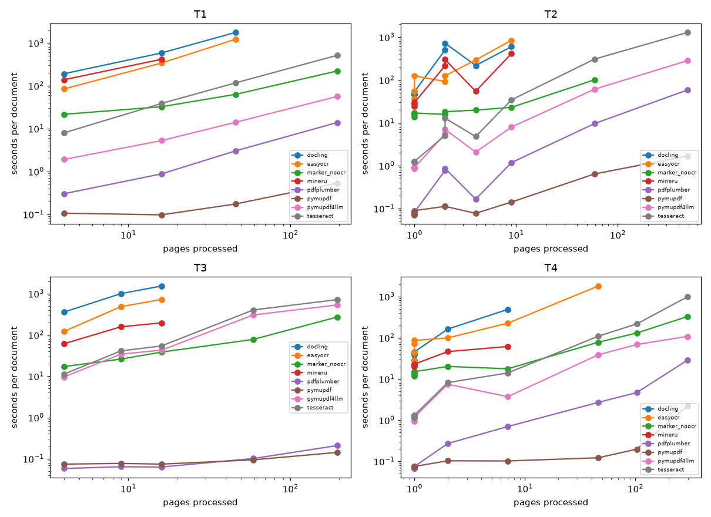
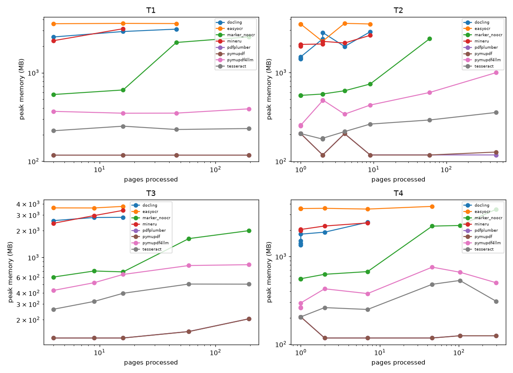

# PDF extraction benchmark report
Hardware (recorded with the runs): 12 CPUs, 22.7 GB RAM, no GPU unless stated (`{"cpus": 12, "total_ram_gb": 22.7, "platform": "Linux-7.0.0-31-generic-x86_64-with-glibc2.43", "python": "3.12.6", "gpu": null}`).
Sampled runs (first pages only, not comparable to full runs): none.

## Capability matrix
| extractor | page_numbers | bboxes | tables | figures | ocr |
|---|---|---|---|---|---|
| pymupdf | yes | yes | no | no | no |
| pymupdf4llm | yes | yes | yes | yes | yes |
| pdfplumber | yes | yes | yes | no | no |
| docling | yes | yes | yes | yes | yes |
| marker (disabled) | yes | no | yes | no | yes |
| marker_noocr (marker variant) | yes | no | yes | no | no |
| mineru | yes | yes | yes | no | yes |
| tesseract | yes | yes | no | no | yes |
| easyocr | yes | yes | no | no | yes |
| paddleocr_vl (disabled) | yes | no | yes | no | yes |

## Extraction quality by tier
### T1: agreement with PyMuPDF's text layer (reference, not truth — pymupdf is the reference itself)
text_similarity by page-count bucket (higher is closer to PyMuPDF). Retrieval hit@5 below is the T1 headline.
| extractor | S | M | L | XL |
|---|---|---|---|---|
| docling | 0.73 | 0.70 | 0.84 | 0.00 |
| easyocr | 0.68 | 0.68 | 0.81 | 0.00 |
| marker_noocr | 0.79 | 0.82 | 0.87 | 0.92 |
| mineru | 0.63 | 0.72 | 0.00 | 0.00 |
| pdfplumber | 0.70 | 0.70 | 0.82 | 0.83 |
| pymupdf | 1.00 | 1.00 | 1.00 | 1.00 |
| pymupdf4llm | 0.69 | 0.69 | 0.83 | 0.84 |
| tesseract | 0.69 | 0.70 | 0.83 | 0.83 |

### T2: teds (higher is better), by page-count bucket
| extractor | S | M | L | XL |
|---|---|---|---|---|
| docling | 0.56 | 0.72 | 0.00 | 0.00 |
| easyocr | 0.00 | 0.00 | 0.00 | 0.00 |
| marker_noocr | 0.54 | 0.84 | 0.80 | 0.00 |
| mineru | 1.00 | 0.77 | 0.00 | 0.00 |
| pdfplumber | 0.57 | 0.09 | 0.03 | 0.20 |
| pymupdf | 0.00 | 0.00 | 0.00 | 0.00 |
| pymupdf4llm | 0.57 | 0.66 | 0.71 | 0.91 |
| tesseract | 0.00 | 0.00 | 0.00 | 0.00 |

### T3: cer (lower is better), by page-count bucket
| extractor | S | M | L | XL |
|---|---|---|---|---|
| docling | 0.42 | 0.43 | 1.00 | 1.00 |
| easyocr | 0.34 | 0.49 | 1.00 | 1.00 |
| marker_noocr | 1.00 | 1.00 | 1.00 | 1.00 |
| mineru | 0.37 | 0.39 | 1.00 | 1.00 |
| pdfplumber | 1.00 | 1.00 | 1.00 | 1.00 |
| pymupdf | 1.00 | 1.00 | 1.00 | 1.00 |
| pymupdf4llm | 0.31 | 0.41 | 0.57 | 0.17 |
| tesseract | 0.31 | 0.36 | 0.43 | 0.17 |

### T4: figure_fact_recall (higher is better), by page-count bucket
| extractor | S | M | L | XL |
|---|---|---|---|---|
| docling | 0.03 | — | — | — |
| easyocr | 0.84 | — | — | — |
| marker_noocr | 0.00 | — | — | — |
| mineru | 0.07 | — | — | — |
| pdfplumber | 0.00 | — | — | — |
| pymupdf | 0.00 | — | — | — |
| pymupdf4llm | 0.55 | — | — | — |
| tesseract | 0.65 | — | — | — |

### Table detection recall by tier
| extractor | T1 | T2 | T3 | T4 |
|---|---|---|---|---|
| docling | 0.50 | 0.57 | 0.50 | 1.00 |
| easyocr | 0.00 | 0.00 | 0.00 | 0.00 |
| marker_noocr | 1.00 | 0.71 | 0.00 | 1.00 |
| mineru | 0.50 | 0.71 | 0.50 | 1.00 |
| pdfplumber | 1.00 | 0.48 | 0.00 | 1.00 |
| pymupdf | 0.00 | 0.00 | 0.00 | 0.00 |
| pymupdf4llm | 1.00 | 0.86 | 1.00 | 1.00 |
| tesseract | 0.00 | 0.00 | 0.00 | 0.00 |

## Retrieval hit@5 — chunking: baseline
### By tier
| extractor | T1 | T2 | T3 | T4 |
|---|---|---|---|---|
| docling | 0.65 | 0.43 | 0.47 | 0.27 |
| easyocr | 0.69 | 0.32 | 0.47 | 0.60 |
| marker_noocr | 0.83 | 0.46 | 0.00 | 0.65 |
| mineru | 0.40 | 0.37 | 0.49 | 0.35 |
| pdfplumber | 0.94 | 0.65 | 0.00 | 0.81 |
| pymupdf | 0.96 | 0.82 | 0.00 | 0.83 |
| pymupdf4llm | 0.96 | 0.71 | 0.88 | 0.73 |
| tesseract | 0.98 | 0.66 | 0.88 | 0.87 |
### By page-count bucket
| extractor | S | M | L | XL |
|---|---|---|---|---|
| docling | 0.65 | 0.83 | 0.26 | 0.00 |
| easyocr | 0.73 | 0.81 | 0.48 | 0.00 |
| marker_noocr | 0.38 | 0.53 | 0.65 | 0.36 |
| mineru | 0.70 | 0.84 | 0.00 | 0.00 |
| pdfplumber | 0.51 | 0.48 | 0.65 | 0.74 |
| pymupdf | 0.65 | 0.50 | 0.69 | 0.76 |
| pymupdf4llm | 0.63 | 0.95 | 0.87 | 0.79 |
| tesseract | 0.68 | 0.84 | 0.91 | 0.93 |

## Retrieval hit@5 — chunking: structure_preserving
### By tier
| extractor | T1 | T2 | T3 | T4 |
|---|---|---|---|---|
| docling | 0.71 | 0.43 | 0.51 | 0.29 |
| easyocr | 0.69 | 0.31 | 0.40 | 0.57 |
| marker_noocr | 0.90 | 0.48 | 0.00 | 0.67 |
| mineru | 0.40 | 0.37 | 0.51 | 0.35 |
| pdfplumber | 0.92 | 0.60 | 0.00 | 0.81 |
| pymupdf | 0.90 | 0.75 | 0.00 | 0.81 |
| pymupdf4llm | 0.96 | 0.72 | 0.84 | 0.71 |
| tesseract | 0.96 | 0.62 | 0.81 | 0.84 |
### By page-count bucket
| extractor | S | M | L | XL |
|---|---|---|---|---|
| docling | 0.63 | 0.93 | 0.28 | 0.00 |
| easyocr | 0.71 | 0.72 | 0.46 | 0.00 |
| marker_noocr | 0.40 | 0.53 | 0.69 | 0.40 |
| mineru | 0.68 | 0.88 | 0.00 | 0.00 |
| pdfplumber | 0.51 | 0.48 | 0.63 | 0.69 |
| pymupdf | 0.60 | 0.47 | 0.65 | 0.74 |
| pymupdf4llm | 0.65 | 0.86 | 0.93 | 0.78 |
| tesseract | 0.68 | 0.76 | 0.91 | 0.84 |

## Speed
Per-document seconds include interpreter start and model loading; the fit separates that fixed cost. The fit is least squares of seconds on pages over full (not sampled) successful runs; with fewer than 3 documents it falls back to mean seconds per page and no fixed cost.
| extractor | fixed s | s/page | docs |
|---|---|---|---|
| docling | 171.6 | 40.020 | 19 |
| easyocr | 65.6 | 31.964 | 20 |
| marker_noocr | 15.8 | 1.115 | 26 |
| mineru | 41.5 | 17.993 | 18 |
| pdfplumber | 0.0 | 0.101 | 27 |
| pymupdf | 0.1 | 0.004 | 27 |
| pymupdf4llm | 20.2 | 0.672 | 27 |
| tesseract | 15.0 | 2.858 | 27 |

### Seconds per page by page-count bucket (raw, includes fixed cost)
| extractor | S | M | L | XL |
|---|---|---|---|---|
| docling | 90.782 | 75.653 | 38.149 | — |
| easyocr | 55.753 | 49.101 | 32.714 | — |
| marker_noocr | 10.931 | 2.469 | 1.518 | 1.222 |
| mineru | 39.318 | 22.064 | — | — |
| pdfplumber | 0.123 | 0.059 | 0.072 | 0.067 |
| pymupdf | 0.058 | 0.010 | 0.005 | 0.003 |
| pymupdf4llm | 1.565 | 1.640 | 1.828 | 0.927 |
| tesseract | 2.129 | 3.223 | 4.216 | 2.873 |

## Speed by kind of PDF
Fitted seconds per page (fixed cost removed where at least 3 documents allow a fit).
### Seconds per page by tier
| extractor | T1 | T2 | T3 | T4 |
|---|---|---|---|---|
| docling | 37.620 | 51.212 | 95.907 | 74.376 |
| easyocr | 27.469 | 96.902 | 48.921 | 38.579 |
| marker_noocr | 1.051 | 1.471 | 1.316 | 1.060 |
| mineru | 30.108 | 39.635 | 10.814 | 6.495 |
| pdfplumber | 0.072 | 0.120 | 0.001 | 0.093 |
| pymupdf | 0.002 | 0.003 | 0.000 | 0.007 |
| pymupdf4llm | 0.285 | 0.577 | 2.739 | 0.375 |
| tesseract | 2.650 | 2.637 | 3.697 | 3.244 |

### Seconds per page by source
| extractor | real | scan | generated |
|---|---|---|---|
| docling | 30.363 | 95.907 | 58.023 |
| easyocr | 31.044 | 48.921 | 76.606 |
| marker_noocr | 1.052 | 1.316 | 1.798 |
| mineru | 18.109 | 10.814 | 10.096 |
| pdfplumber | 0.111 | 0.001 | 0.030 |
| pymupdf | 0.004 | 0.000 | 0.001 |
| pymupdf4llm | 0.501 | 2.739 | 0.355 |
| tesseract | 2.775 | 3.697 | 1.174 |

## Peak memory (MB)
| extractor | S | M | L | XL |
|---|---|---|---|---|
| docling | 1897 | 2778 | 3108 | — |
| easyocr | 3340 | 3591 | 3660 | — |
| marker_noocr | 573 | 690 | 2112 | 2564 |
| mineru | 2122 | 2903 | — | — |
| pdfplumber | 172 | 121 | 125 | 138 |
| pymupdf | 172 | 121 | 125 | 140 |
| pymupdf4llm | 337 | 465 | 629 | 677 |
| tesseract | 212 | 296 | 376 | 387 |

## Peak memory by kind
### Peak memory (MB) by tier
| extractor | T1 | T2 | T3 | T4 |
|---|---|---|---|---|
| docling | 2854 | 2064 | 2742 | 1737 |
| easyocr | 3593 | 3164 | 3650 | 3545 |
| marker_noocr | 1485 | 822 | 1125 | 1274 |
| mineru | 2721 | 2180 | 2918 | 2108 |
| pdfplumber | 118 | 157 | 145 | 158 |
| pymupdf | 118 | 157 | 145 | 158 |
| pymupdf4llm | 364 | 455 | 647 | 423 |
| tesseract | 233 | 233 | 397 | 295 |

### Peak memory (MB) by source
| extractor | real | scan | generated |
|---|---|---|---|
| docling | 2627 | 2742 | 1552 |
| easyocr | 3283 | 3650 | 3526 |
| marker_noocr | 1498 | 1125 | 564 |
| mineru | 2437 | 2918 | 2037 |
| pdfplumber | 119 | 145 | 205 |
| pymupdf | 119 | 145 | 205 |
| pymupdf4llm | 513 | 647 | 273 |
| tesseract | 288 | 397 | 206 |

## Failures
| extractor | failed runs |
|---|---|
| docling | 8 |
| easyocr | 7 |
| marker_noocr | 1 |
| mineru | 9 |
| pdfplumber | 0 |
| pymupdf | 0 |
| pymupdf4llm | 0 |
| tesseract | 0 |

### Failed runs by document
A failed run scores 0 on every quality metric above (oom = exceeded the memory cap, timeout = exceeded the time cap, error = the tool raised). Empty cells are successful runs.
| document | docling | easyocr | marker_noocr | mineru | pdfplumber | pymupdf | pymupdf4llm | tesseract |
|---|---|---|---|---|---|---|---|---|
| erp2024_full (487 pp) | oom | timeout | oom | oom |  |  |  |  |
| nasa_se_handbook (297 pp) | oom | timeout |  | oom |  |  |  |  |
| rfc9110 (194 pp) | oom | timeout |  | oom |  |  |  |  |
| scan_rfc9110 (194 pp) | oom | timeout |  | oom |  |  |  |  |
| nasa_tm104114 (103 pp) | oom | timeout |  | oom |  |  |  |  |
| p60_282 (59 pp) | timeout | timeout |  | oom |  |  |  |  |
| scan_p60_282 (59 pp) | timeout | timeout |  | oom |  |  |  |  |
| nasa_tm100396 (46 pp) | timeout |  |  | oom |  |  |  |  |
| rfc9112 (46 pp) |  |  |  | oom |  |  |  |  |

## Recommendation (from hit@5, chunking: structure_preserving)
Best extractor per tier: **T1** → pymupdf4llm, **T2** → pymupdf, **T3** → pymupdf4llm, **T4** → tesseract
Best single extractor overall: **pymupdf4llm** (hit@5 0.80).
A per-tier router using those picks would score hit@5 0.84 (+0.04 vs the best single extractor). This is an estimate from tier-level picks, not a measured per-page router.

Failure gallery: not included in the public repository (it embeds page images and exceeds 5 MB); `python -m benchmarks.pdf_extraction.report.build_report` regenerates it from a local run.
